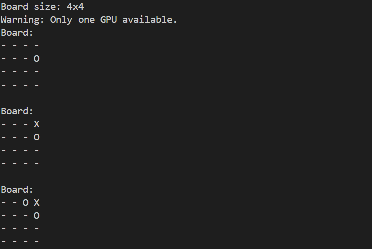
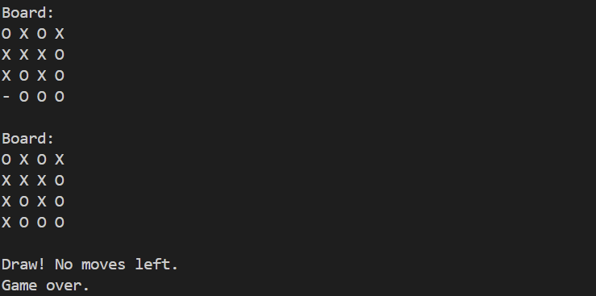

# 🎮 CUDA-based Tic-Tac-Toe Game


## 📖 Project Description

This project implements a **CUDA-based Tic-Tac-Toe game** where two players use predefined strategies to compete. The game leverages NVIDIA GPUs for multi-GPU computation, showcasing basic strategy-driven gameplay.

🎥 **Watch the presentation of this project on YouTube**: [CUDA Tic-Tac-Toe: Competing GPUs | Honors Peer-Graded Assignment](https://youtu.be/r3o4ieNgmJE?si=4MrqHwDEOOzSOwu4)

## 📑 Table of Contents
- [Project Description](#-project-description)
- [Getting Started](#-getting-started)
- [Compilation](#-compilation)
- [Execution](#-execution)
- [Example Output](#-example-output)
- [Customization](#-customization)
- [Known Issues](#-known-issues)
- [Debugging](#-debugging)
- [Author](#-author)
- [License](#-license)


## 🚀 Getting Started

### 🛠 Prerequisites
Ensure you have the following installed:
- **CUDA Toolkit** (Tested with CUDA 12.6 or later)
- **NVIDIA GPU** with the proper driver installed

### 🖥 Compilation
Navigate to the project directory and compile the code using:

```bash
nvcc -o tic_tac_toe game.cu
```

### 🕹 Execution
To run the game with a default 3x3 board:

```bash
./tic_tac_toe
```

To run with a custom square board size, such as 4x4:

```bash
./tic_tac_toe 4
```

### 🖼 Example Output
Here’s how the game looks:

#### 4x4 Board - Initial Moves



.

.

.

#### 4x4 Board - Game Result: Draw




### 🛠 Customization
The game logic allows you to adjust the board size. Simply pass the desired size as a command-line argument.

### ⚠ Known Issues
Ensure the board size is appropriate for the game. The win condition is tied to the number of rows and columns.

### 🔍 Debugging
The game includes detailed debugging output to help understand the internal game logic.

## 👥 Author
Developed as part of a CUDA programming exercise to leverage GPU parallelism.

## 📜 License
This project is licensed under the MIT License. See the [LICENSE](LICENSE) file for details.
